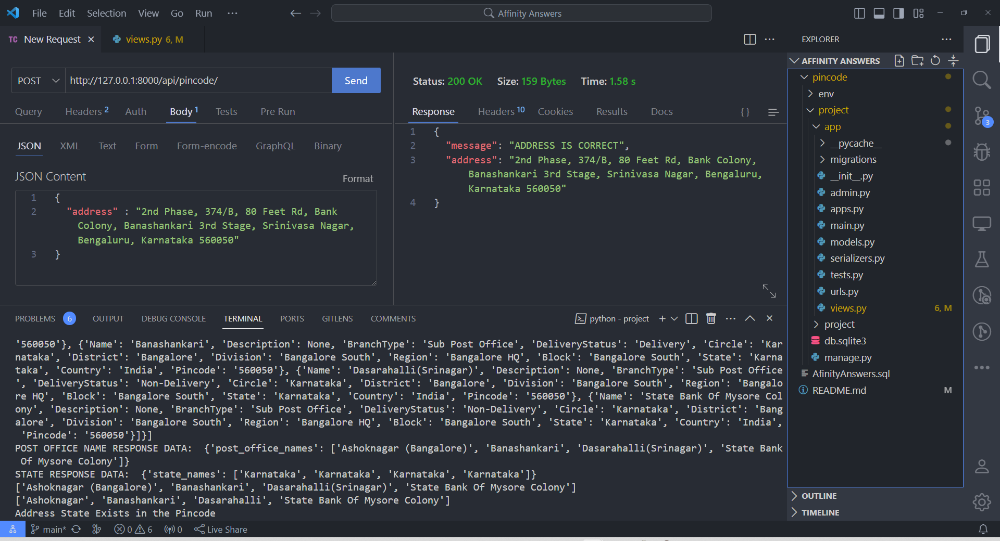
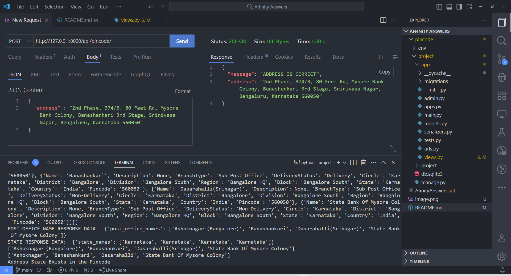
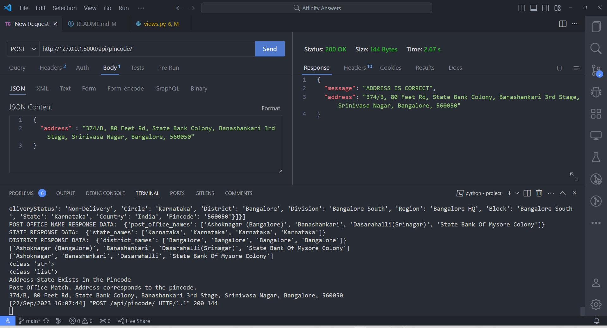
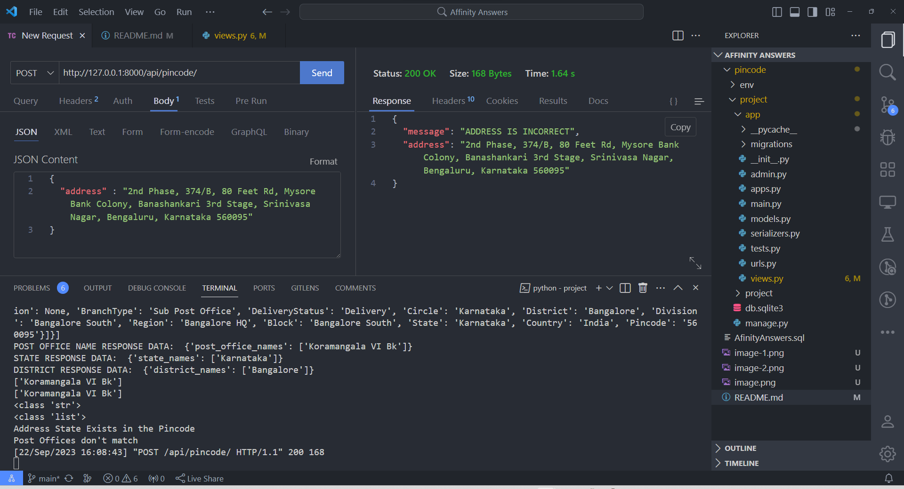
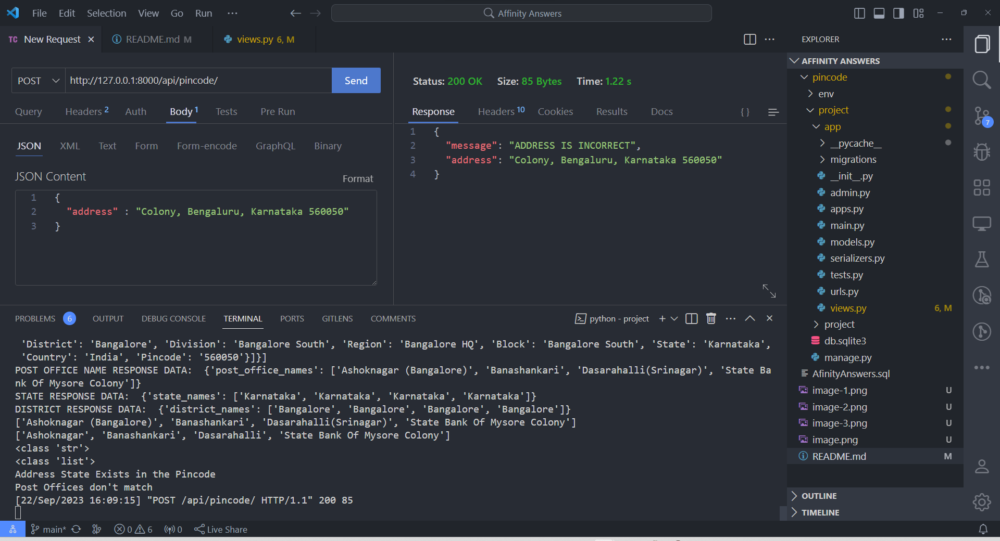

# AffinityAnswersSolutions

## List the test cases you would use to test your program.

#### 1. Valid address with correct PIN code.
#### 2. Valid address with incorrect PIN code.
#### 3. Valid address with missing PIN code.
#### 4. Valid address with inccorect PIN code format.(eg.!!!!!!, 20001)

#### These test cases cover scenarios where the PIN code and address should match and where they should not match. You can expand these test cases as needed to further validate the program's functionality.
#### To make the program more precise and robust, you can incorporate a distance calculation API to check the proximity of the address to the provided PIN code location.

## API EXECUTION SCREENSHOTS

## B. Find all the columns that can be used to connect the tables in the given database.

#### table rfamseq: ncbi_id
#### table family: rfam_acc, rfam_id
#### table taxonomy: ncbi_id
#### table clan_membership:  rfam_acc, clan_acc
#### table clan:  clan_acc
#### table full_region: rfam_acc, rfamseq_acc

